# Projeto final parte 1 - Ingestão dos dados
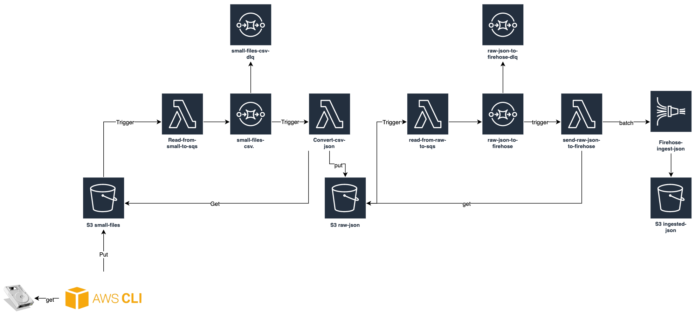


## Preparando o ambiente

1. Execute `cd ~/environment/caminho-engenharia-de-dados` para entrar na pasta do projeto
2. Baixe a versão mais recente do código com `git pull origin master`
3. Entre na pasta do projeto final `cd 08 - FinalLab/part1`
4. Utilize virtual env para ter menos problemas com dependencias Python com os comandos a seguir.
    ``` shell
    sudo pip3 install virtualenv
    virtualenv ~/.venv
    source ~/.venv/bin/activate
    ```
5. Iremos utilizar um dataset do kaggle para fazer o bootcamp, instale o sdk da api para conseguir fazer o download via terminal `pip3 install kaggle`
6. Em outra aba do navegador entre na sua conta do kaggle - [login](https://www.kaggle.com/city-of-seattle/seattle-library-collection-inventory)
7. Clique na sua foto no canto superior direito e clique em `Account`
8. Desça a tela até a opção API e clique em 'Create new API Token'
    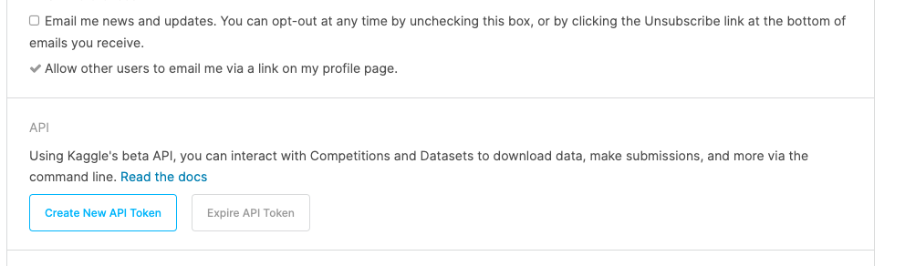
9. Um arquivo, kaggle.json ,será baixado para sua maquina, abra o arquivo e copie o conteúdo.
10. De volta ao terminal do Cloud9, execute o comando `mkdir -p ~/.kaggle`
11. Execute o comando abaixo copiando o conteudo do kaggle.json que baixou e colocando entre aspas simples como na imagem:
    ```
      echo 'SEU JSON USER COM TOKEN' >> ~/.kaggle/kaggle.json
    ```
    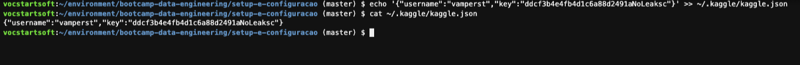
12. Execute o comando `chmod 600 ~/.kaggle/kaggle.json` para colcoar a permissão certa no token
13. Vamos criar o lugar onde ficarão os dados na maquina. Para isso crie a pasta com o comando ` mkdir ~/environment/seattle-library-collection-inventory` e entre nela `cd ~/environment/seattle-library-collection-inventory`
14. Vamos baixar o dataset na maquina com o comando `kaggle datasets download -d city-of-seattle/seattle-library-collection-inventory`
15. AO termino do download execute o comando `unzip seattle-library-collection-inventory.zip` para descompactar o conteúdo.
16. Apague o zip que baixou e já não é mais necessário com comando `rm seattle-library-collection-inventory.zip`]

## Criando a infrastrutura

16. Primeiro vamos criar 4 filas no SQS, para isso abre o console e no canto esquerdo superior clique em `serviços`, digite `sqs` e selecione para abrir.
   
17. Inicialmente vamos criar as 2 filas DLQ: `raw-json-dlq` e `small-files-csv-dlq`. 'Clique em criar uma nova fila', apenas coloque os nomes, mantenha as opções padrão e clique em 'Criar fila rápido'.
  
18. Agora vamos as filas principais: `raw-json` e `small-files-csv`. Clique novamente em 'Clique em criar uma nova fila' coloque o nome e clique em 'configurar fila'. Em `Configurações da Fila de mensagens mortas` deixe como na imagem. Lembrando que cada fila tem sua respectiva DLQ. E clique em `Criar fila`
   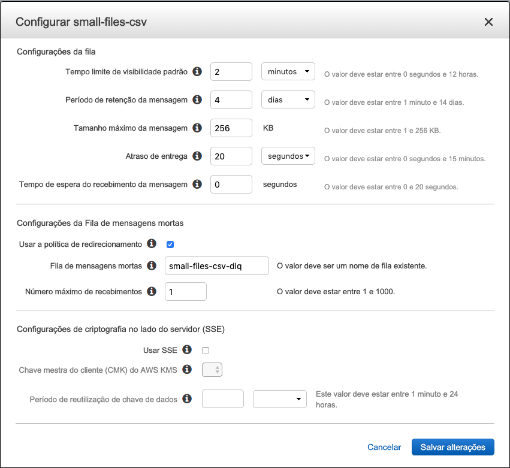
   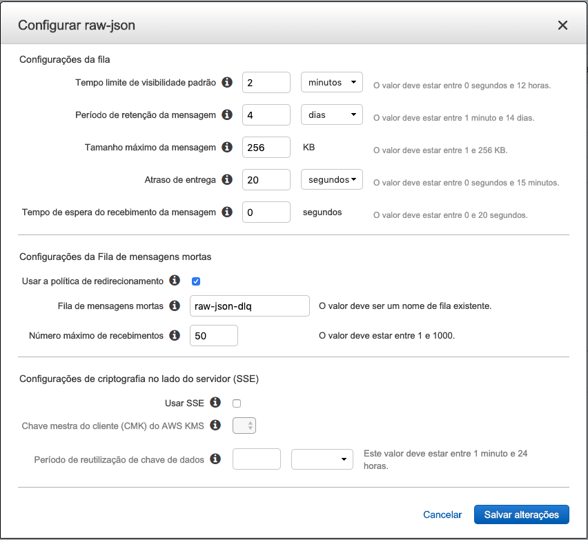
   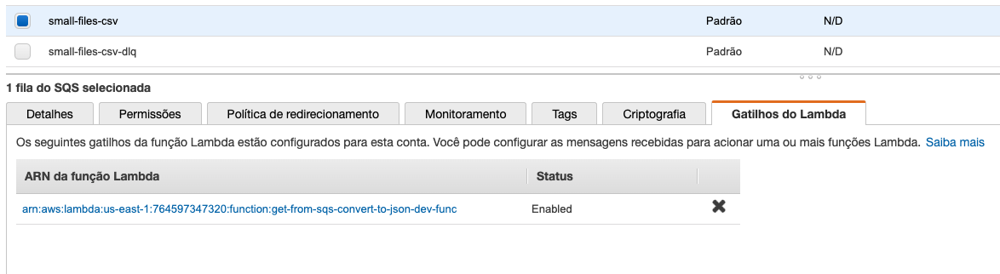
19. Ao final devem haver 4 filas:
   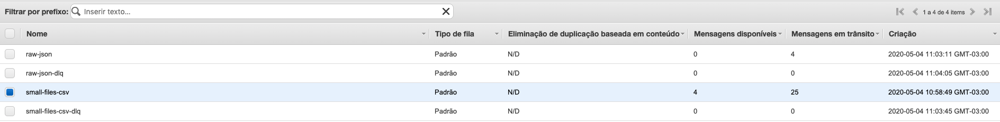
20. Agora vamos configurar as filas para fazer a ingestão por eventos. Vá para o console do SQS.
21. Selecione a fila `small-files-csv` e clique em 'Editar'. Certifique de que esta como na imagem:
   
22. Agora vamos configurar a `raw-json`, certifique que esta como na imagem:
   
23. Foi necessário aumetar bastante o número máximo de recebimentos porque vamos limitar a quantidade de lambdas que consomem essa fila rodando em paralelo. Porem o SQS continua tentando entregar e recebendo a indispobilidade. Mias infos podem ser encontradas no artigo: [Lambda Concurrency Limits and SQS Triggers Don’t Mix Well](https://medium.com/@zaccharles/lambda-concurrency-limits-and-sqs-triggers-dont-mix-well-sometimes-eb23d90122e0)
24. Para não precisar lidar com um arquivo muito grande vamos dividir em varias partes, para tal vá ao terminal do cloud9.
25. Entre na pasta do dataset com o comando `cd ~/environment/seattle-library-collection-inventory/`
26. Crie a pasta para os arquivos menores com o comando `mkdir files-small`
27. Vamos criar arquivos de 100.000 linhas cada com o comando`split -d -l 100000 library-collection-inventory.csv files-small/inventory.part.` 
28. Pode ser que o comando demore um pouco para executar
29. Enquanto o código executa vamos criar o bucket que será utilizado no exercicio final. Para isso vá ao console do S3.
30. No canto supeiror direito clique em `Criar bucket`
31. Os nomes no S3 são unicos em toda a AWS não somente sua conta, vamos nomear seu bucket como `bootcamp-data-engineering-<Numero Aleatório>` e clique em criar bucket
32. Devolta ao terminal do CLoud9, agora vamos retirar o cabeçalho do primeiro arquivo para que não atrapalhe na ingestão. Para tal utilize o comando `sed -i '$d' files-small/inventory.part.00`
    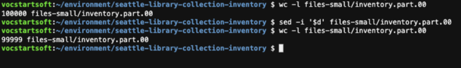
33. Execute o comando `rm files-small/inventory.part.9*` para deixar apenas 90 arquivos gerando um total de 4.5Gb deixando as fases do bootcamp mais rápidas.
34. Vá para a pasta do projeto que baixou do git com o comando `cd ~/environment/caminho-engenharia-de-dados/08\ -\ FinalLab/part1/lambda-put-in-sqs-from-s3`
35. No IDE vá para o arquivo `caminho-engenharia-de-dados/08 - FinalLab/part1/lambda-put-in-sqs-from-s3/serverless.yml` e altere as 2 variáveis `bucket` colocando o nome do seu bucket. Na variável `urlSQS` da função 'small-files-csv' coloque o valor da URL da sua fila 'small-files-csv'. por ultimo na variável `urlSQS` da função 'raw-json' coloque o valor da URL da sua fila 'raw-json'.
    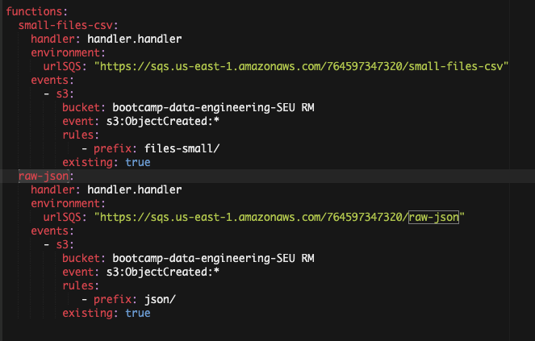
36. No terminal execute o comando `sls deploy`
37. Se for ao painel do seu bucket no S3 irá notar que tem 2 gatilhos no bucket. Vá a raiz do bucket e selecione propriedades. 
    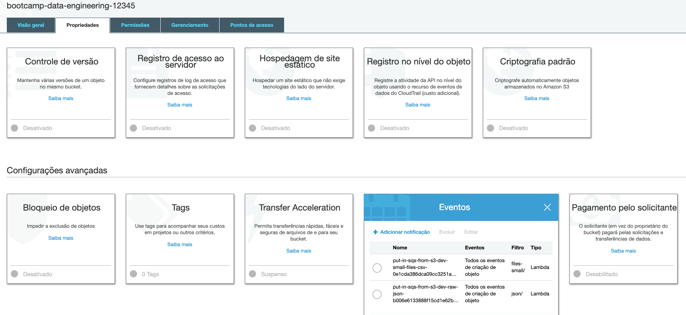
38. Voltando ao terminal do Cloud9, agora vamos fazer o deploy da função que irá ler da fila o csv e transformar em json. Execute o comando `cd ~/environment/caminho-engenharia-de-dados/08\ -\ FinalLab/part1/lambda-get-from-sqs-convert-to-json/` para entrar na pasta.
39. Recomendo que ao mudar de pasta feche todas as abas de arquivos abertas no IDE para não se confundir. Vários arquivos tem o mesmo nome.
40. Abra o arquivo `caminho-engenharia-de-dados/08 - FinalLab/part1/lambda-get-from-sqs-convert-to-json/serverless.yml` no IDE. Altere a variável `arn` colocando o ARN da sua fila `small-files-csv`. No painel do SQS é a propriedade descrita abaixo da URL da fila.
    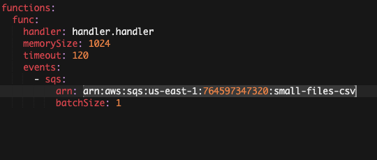
41. No terminal execute o comando `sls deploy`
    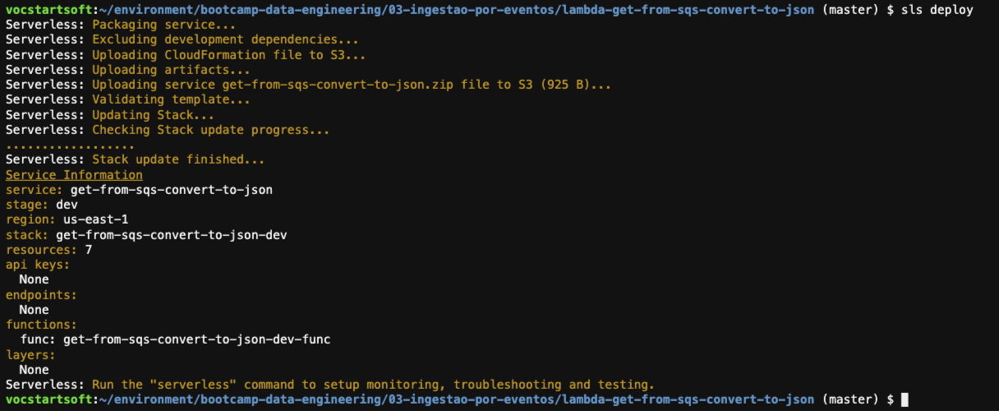
42. Se olhar o painel sqs da fila `small-files-csv` verá que tem um gatilho.
43. Para entrar na pasta do ultimo componente a fazer deploy para nossa arquiterura por eventos execute o comando `cd ~/environment/caminho-engenharia-de-dados/08\ -\ FinalLab/part1/lambda-get-from-sqs-to-firehose/` no terminal do cloud9.
44. Altere o ARN da fila raw-json no arquivo serverless.yml como fez nos passos anteriores.
45. Execute `sls deploy`
46. Vamos criar o kinesis firehose que vamos utilizar nesse bootcamp. Em outra aba vá para o console do kinesis. CLique em `Criar stream de entrega`
    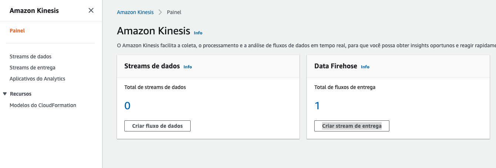
47. De o nome de `ingest-json` e clique em 'next'
    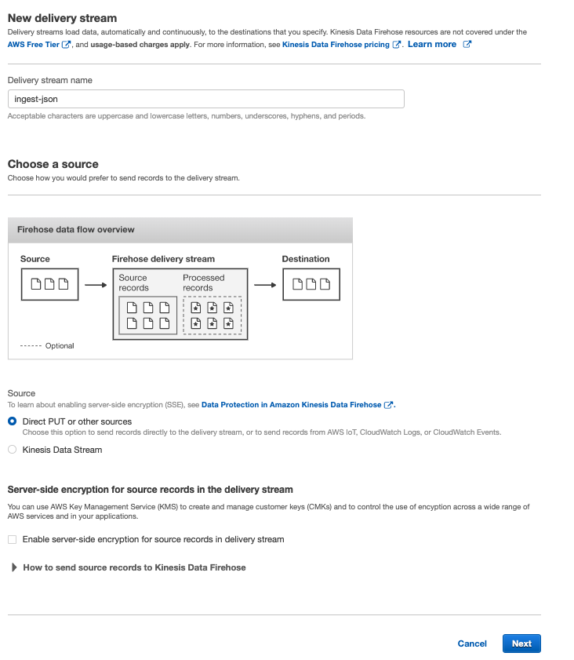
48. Clique em `Next` novamente.
49. Na seção 'S3 destination' escolha o bucket que acabou de criar.
50. Na seção 'S3 prefix' coloque os valores `ingested-json/` em 'Prefix - optional', `ingested-json-error/` em 'Error prefix - optional'.
51. Na seção 'S3 buffer conditions' coloque o valor `100` em 'Buffer size' e `300` em 'Buffer interval'.
    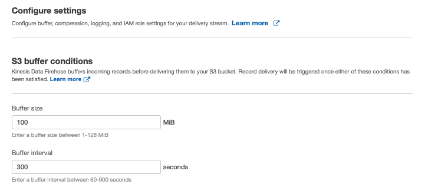
52. Na seção 'Permissions' clique em 'Create or update IAM role'
53. Clique em 'Next'
54. Revise as informações e clique em `Create delivery stream`
55. No terminal do Cloud9 execute o comando `aws s3 cp --recursive ~/environment/seattle-library-collection-inventory/files-small/ s3://bootcamp-data-engineering-<Numero Aleatório>/files-small/` alterando o nome do bucket para o seu. Esse comando vai colocar os CSVs novamente no bucket e iniciar o processo.
56. Você poderá acompanhar o processo pelas filas do SQS. Primeiro na fila `small-files-csv` depois na `raw-json`
    
    
57. O processo irá demorar ao menos 10 minutos para terminar
58. Se for para o painel da função lambda `get-from-sqs-to-firehose-dev-put` clicar em 'Monitor' e após `Visualizar logs no CloudWatch` terá acesso aos logs do lambda enviando dados para o firehose.
59. Escolha um dos streams de logs e acompanhe o quando quiser o processamento.
    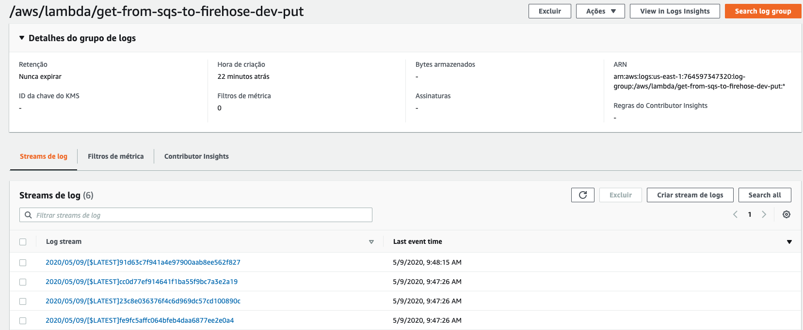
60. Após todas as filas zerarem espere 5 minutos pois é o tempo máximo que configuramos no firehose para fazer pacotes para o S3.
61. Navegue pelo S3 e veja os arquivos ingeridos.