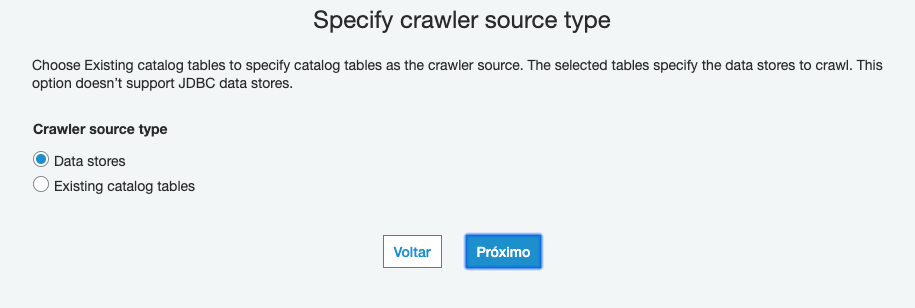
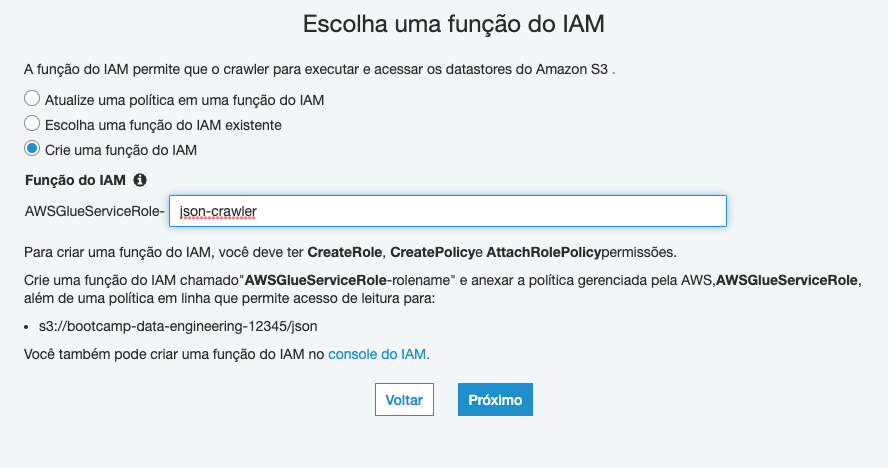
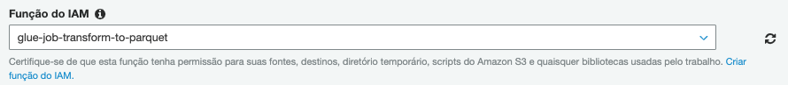
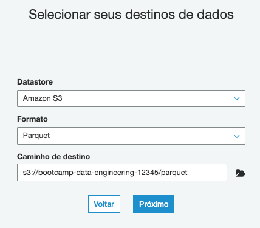
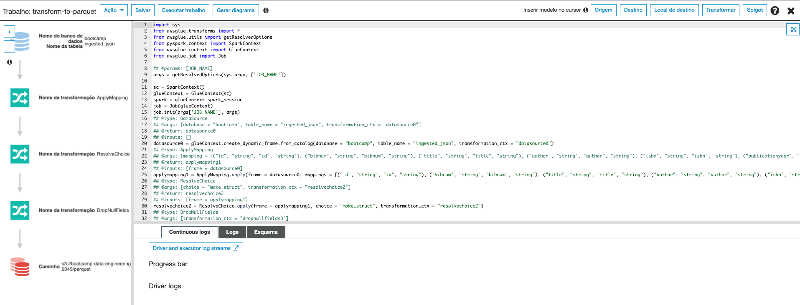
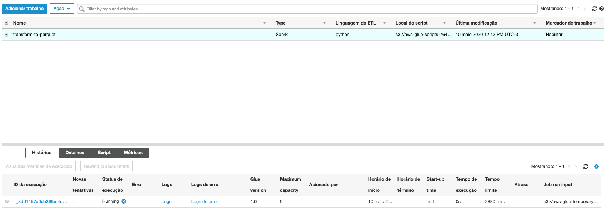

1. Vamos criar o DynamoDB utilizado para esse desafio. Para tal execute o comando:
   ```
   aws dynamodb create-table \
        --table-name susep-sinistro \
        --attribute-definitions AttributeName=id,AttributeType=S \
        --key-schema AttributeName=id,KeyType=HASH \
        --billing-mode PROVISIONED \
        --stream-specification StreamEnabled=true,StreamViewType=NEW_IMAGE \
        --provisioned-throughput ReadCapacityUnits=5,WriteCapacityUnits=5
   ```
2. Para criar o bucket apenas para esse desafio execute o comando alterando a <NUMERO RANDOMICO> por um numero de sua preferencia afim de criar um nome unico de bucket.:
   ``` shell
   export nomeBucket=desafio-fiap-susep-<NUMERO RANDOMICO>
   aws s3api create-bucket --bucket $nomeBucket --region us-east-1
   ```
3. Agora precisamos criar o firehose que será responsavel por receber os dados. Mas primeiro é necessario criar a role utilizada. Para isso execute o comando:
   ``` shell
    cd ~/environment/caminho-engenharia-de-dados/ && git pull origin master
    cd Desafio-Final/
    export outputPolicy=$(aws iam create-policy --policy-name policy-firehose-susep --policy-document file://firehose-policy.json)
    export policyArn=$(echo $outputPolicy | jq .Policy.Arn | sed 's/"//g')
    aws iam create-role --role-name role-firehose-susep --assume-role-policy-document file://trust-policy.json
    aws iam attach-role-policy --policy-arn $policyArn --role-name role-firehose-susep
    aws iam attach-role-policy --policy-arn arn:aws:iam::aws:policy/AdministratorAccess --role-name role-firehose-susep
    export roleARN=$(aws iam get-role --role-name role-firehose-susep | jq .Role.Arn)
   ```
4. Agora sim, vamos criar o Firehose. Execute os comandos abaixo:
   ``` shell
    sed -i "s/NOMEBUCKET/$nomeBucket/g" test.txt
    echo $(python -c "import sys;lines=sys.stdin.read();print(lines.replace('ROLEFIREHOSEARN',$(echo $roleARN)))" < firehose-create.json) | jq >> firehose-create.txt
    aws firehose create-delivery-stream --cli-input-json file://firehose-create.txt
   ```
5. Vamos fazer o deploy do lambda que vai consumir os dados do stream do dynamo e enviar para o Kinesis Firehose. Para isso entre na pasta do código com o comando `lambda-read-dynamo-stream` e abra o arquivo serverless.yml com o comando `c9 open serverless.yml`
6. Será necessário preencher as variaveis custom como na imagem abaixo:

7. O dado de `dynamo-stream-arn` pode ser pego na pagina inicial da tabela do dynamo criada para o exercicio. E a variavel `kinesisName` é `susep-ingest`
    
8. O dado de `dynamo-stream-arn` pode ser pego na pagina inicial da tabela do dynamo criada para o exercicio. E a variavel `kinesisName` é `susep-ingest`
    
9. Após salvar o arquivo execute o seguinte comando na linha de comando `sls deploy` para criar o lambda e seus periféricos necessários.
10. Agora vamos baixar o dataset para que possamos inserir no dynamoDB. Para isso precisamos instalar um componente afim de baixar conteudo direto do google drive. Execute os comandos a seguir para instalar.
``` shell
cd ~/environment
wget https://github.com/prasmussen/gdrive/releases/download/2.1.1/gdrive_2.1.1_linux_386.tar.gz
tar xvzf gdrive_2.1.1_linux_386.tar.gz
chmod +x gdrive
```
11. Vamos baixar o zip do dataset com o seguinte comando: `gdrive download 1EkzziJA6uWeuerhyugzw5ziBMYHsLfxq`. Ele vai pedir para acessar uma URL como na imagem para pegar um código de confirmação. Um gmail será necessário para autenticar. Acesse a URL pelo navegador.
    
    
12. Permita a aplicação clicando em 'Permitir'e copie o código na tela que aparecer.
    
13. Cole o comando copiado no terminal como na imagem e aperte enter
    
14. Aguarde o download do arquivo terminar
    
15. Ao termino do download executar o comando abaixo para criar a pasta onde os arquivos vão ficar e descompactar o zip baixado.
    ``` shell
    sudo apt install zip unzip
    unzip susep-in-jsons.zip jsons-susep/
    ```
16. Vamos aumentar a capacidade da tabela do DynamoDB afim de conseguir fazer uma inserção mais rapida. Execute o comando abaixo:
    ```
    aws dynamodb update-table \
        --table-name susep-sinistro \
        --billing-mode PROVISIONED \
        --provisioned-throughput ReadCapacityUnits=5,WriteCapacityUnits=1500
    ```
17. Entre na pasta onde esta o script responsavel por inserir os dados no DynamoDB com o comando `cd ~/environment/caminho-engenharia-de-dados/Desafio-Final/`
18. Execute o comando `python3 insertDataon-DynanoDB.py /home/ubuntu/environment/json/ 3` para utilizar 3 Threads inserir batchs de dados no dynamoDB.
    
19. Esse processo pode demorar bastante para terminar.
20. Se tudo estiver correto em aproximadamente 5 minutos será possivel ver os arquivos sendo entregues no S3 pelo Kinesis firehose.
    
21. Enquanto esse processo roda, inicie a criação do crawler do Glue para que possamos converter os arquivos em parquet posteriormente. Abra outra aba com o console AWS e entre no painel do serviço Glue e clique em `Crawlers` na lateral esquerda.
   
22. Clique em `Adicionar crawler`
23. Coloque o nome de `json-susep` e clique em 'Próximo'
   
    Escolha `Data stores` e clique em 'Próximo'
   
24. Clique no icone da pasta ao lado do campo texto de `Incluir caminho`. Expanda as pastas do seu bucket susep criado e selecione `ingested-json`. Clique em `Selecionar` e `Próximo`. Note que a imagem é meramente ilustrativa.
   
25. Deixe o `Não` selecionado e clique em próximo.
26. Complete o nome do função IAM com `json-susep-crawler` e clique em 'Próximo'
   
27. Deixe em `Executar sobre demanda` e clique em 'Próximo'
28. Clique em `Adicionar banco de dados` e de o nome de `susep`. Clique em 'Criar' e 'Próximo'
    
29. Revise e clique em `Concluir`
30. Devolta a tela principal dos crawlers você irá ver uma mensagem oferecendo executar o recém criado crawler. Clique em `Executar agora?`
    
31. Aguarde o crawler voltarem ao estado ready como na imagem.
    
32. Abra em outra aba o serviço `Athena`
33. Selecione o banco de dados `susep`
    
34. Faça o carregamento das partições criadas para a tabela ingested-json. Clique nos 3 pontos ao lado do nome da tabela e selecione `Load partitions`
35. Se clicar nos 3 pontos e selecionar `Preview table` na tabela e verá uma amostra dos dados da tabela.
    
36. De volta ao Glue, vamos fazer a conversão dos arquivos Json para [parquet](https://parquet.apache.org/documentation/latest/) para que o tamanho diminua e as queries e pesquisas fiquem otimizadas utilizando o Athena. Para isso no menu lateral clique em `Trabalhos`
    
37. Clique em `Adicionar trabalho`
38. De o nome de `susep-parquet`
39. No campo `Função do IAM` clique em `Criar função do IAM.` no texto abaixo. Isso vai abrir uma nova aba em IAM para criarmos a função que será usada pelo Glue Job.
40. Clique em `Criar função`
41. Selecione o `Glue` na lista de serviços e clique em `Próximo: Permissões`
    
42. Para fins de demo, selecione `AdministratorAccess` e clique em `Próximo: Tags`. Sempre bom lembrar que quando for implantar em um ambiente real é necessário fazer as permissões mais restritivas possiveis
43. Clique em `Próximo: Revisar`
44. Coloque o nome `glue-job-susep-to-parquet` e clique em `Criar função`.
45. De volta a tela de criação de trabalho do Glue clique no icone de atualização das funções IAM e selecione a recém criada `glue-job-susep-to-parquet`.
    
46. Em propriedades avançadas marque `Habilitar` em `Marcador de trabalho`. Em Monitoring options marque `Métricas do trabalho` e `Continuous logging`.
    
47. Clique em `Próximo`
48. Escolha a fonte de dados `ingested_json` e clique em `Próximo`
49. Mantenha `Change schema` selecionado e clique em `Próximo`
50. Selecione `Criar tabelas em seu destino de dados` e deixe como na imagem. Importante: a pasta parquet ainda não existe em seu bucket SUSEP, apenas selecione seu bucket e digite `/parquet`.
    
    
51. Clique em `Próximo`
52. Clique em `Salvar trabalho e editar script`.
53. Nessa tela você pode avaliar o script pyspark criado automaticamente e alterar caso queira. 
    
54. Clique em `Executar trabalho` no topo esquerdo da página. O procedimento pode levar até 15 minutos.
55. Clique no `X` no canto direito superior.
56. Selecione o trabalho criado e poderá acompanhar o estágio dele pela aba histórico
    
57. Aguarde até que o job fique com o status `Succeeded` 
    
58. Crie um crawler com o nome `susep_parquet` apontando para a nova pasta criada no seu bucket e o execute.
    
59. Após o novo crawler executar volte para a aba do Athena e atualize as tabelas. Verá que uma nova tabela esta disponivel. Tabela `parquet`.
    
60. Faça o Load das partições
61. Execute o preview da tabela. 
    