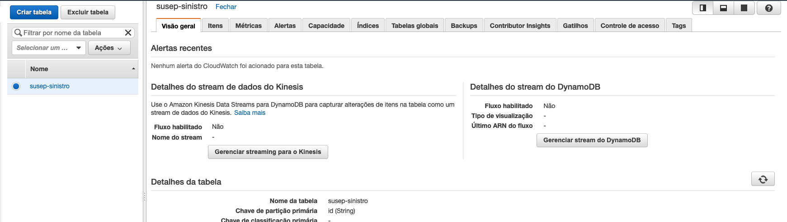

1. Primeiramente vamos criar o DynamoDB que será utilizado, para isso entre no serviço `DynamoDB` e clique em `Criar tabela`
2. Preencha a tela com os dados abaixo:
    1. Nome da tabela: susep-sinistro
    2. Chave de Partição: id
    
3. Clique em `Criar`
4. Após o termino da criação da tabela precisamos ativar o Streaming que será utilizado para capturar os dados. Para tal, clique na tabela criada e após clique em `Gerenciar Stream do DynamoDB`
   
5. Selecione `Imagem nova – o item inteiro, como aparece depois de ter sido modificado` e clique em `Habilitar`
   
6. Agora vamos criar o bucket S3 a ser utilizado no desafio, entre no console do S3 e clique em `Criar Bucket`
7. De o nome de `desafio-fiap-susep-<NUMERO RANDOMICO>` e crie.
8. Agora é necessário que o kinesis firehose seja criado. Entre no painel do kinesis e clique em `Criar stream de entrega`
   