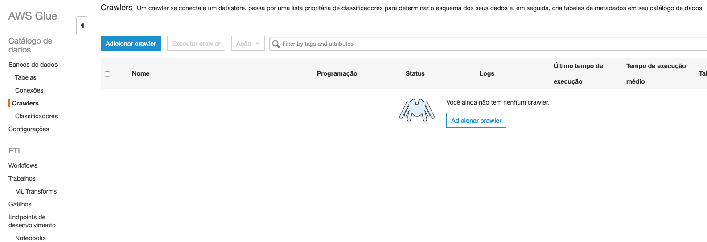
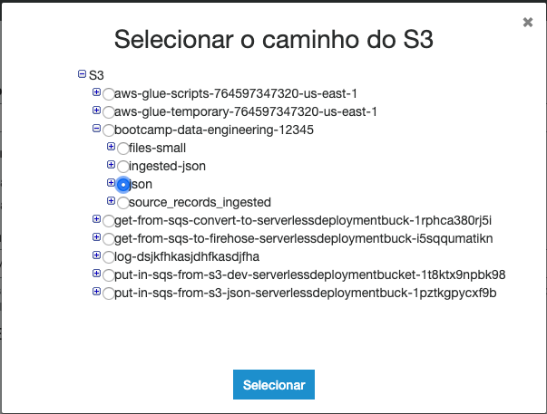
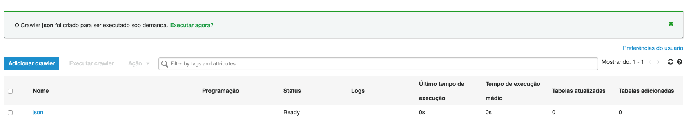
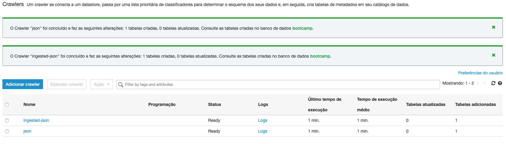
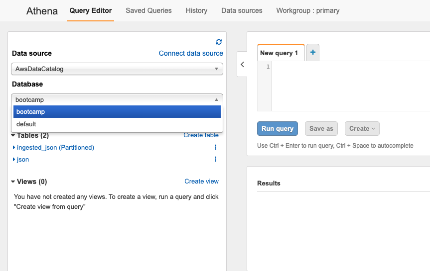
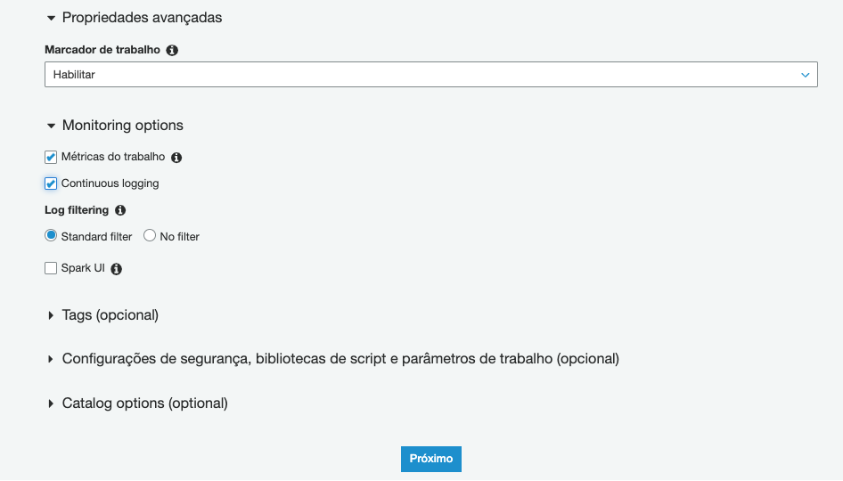

1. Primeiramente vamos criar o DynamoDB que será utilizado, para isso entre no serviço `DynamoDB` e clique em `Criar tabela`
2. Preencha a tela com os dados abaixo:
    1. Nome da tabela: susep-sinistro
    2. Chave de Partição: id
    
3. Clique em `Criar`
4. Após o termino da criação da tabela precisamos ativar o Streaming que será utilizado para capturar os dados. Para tal, clique na tabela criada e após clique em `Gerenciar Stream do DynamoDB`
   
5. Selecione `Imagem nova – o item inteiro, como aparece depois de ter sido modificado` e clique em `Habilitar`
   
6. Agora vamos criar o bucket S3 a ser utilizado no desafio, entre no console do S3 e clique em `Criar Bucket`
7. De o nome de `desafio-fiap-susep-<NUMERO RANDOMICO>` e crie.
8. Agora é necessário que o kinesis firehose seja criado. Entre no painel do kinesis e clique em `Criar stream de entrega`
   
9. De o nome de `susep-ingest` ao streaming e clique em `next`
10. Na tela `Process records` não altere nada e clique em `next`
11. Na tela `Choose a destination` preencha da seguinte maneira:
    1.  Destination: Amazon S3
    2.  S3 bucket: desafio-fiap-susep-<NUMERO RANDOMICO>
    3.  S3 Prefix: ingested-json/
    4.  S3 error prefix: error-ingested-json/
    
12. Clique em next
13. Na tela `Configure settings` coloque os seguintes valores nos campos de `S3 buffer conditions` e deixe o restante da tela como o padrão:
    1.  Buffer size: 100
    2.  Buffer interval: 300
14. Clique em `Next`
15. Revise os dados e clique em `Create delivery stream` se estiver tudo ok.
16. Abra o Cloud9 e execuete o comando `cd ~/environment/caminho-engenharia-de-dados/ && git pull origin master` para atualizar a os arquivos da pasta dos tutoriais. 
17. Entre na pasta do desafio com o comando `cd Desafio-Final/`
18. Vamos fazer o deploy do lambda que vai consumir os dados do stream do dynamo e enviar para o Kinesis Firehose. Para isso entre na pasta do código com o comando `lambda-read-dynamo-stream` e abra o arquivo serverless.yml com o comando `c9 open serverless.yml`
19. Será necessário preencher as variaveis custom como na imagem abaixo:

20. O dado de `dynamo-stream-arn` pode ser pego na pagina inicial da tabela do dynamo criada para o exercicio. E a variavel `kinesisName` é `susep-ingest`
    
21. Após salvar o arquivo execute o seguinte comando na linha de comando `sls deploy` para criar o lambda e seus periféricos necessários.
22. Agora vamos baixar o dataset para que possamos inserir no dynamoDB. Para isso precisamos instalar um componente afim de baixar conteudo direto do google drive. Execute os comandos a seguir para instalar.
``` shell
cd ~/environment
wget https://github.com/prasmussen/gdrive/releases/download/2.1.1/gdrive_2.1.1_linux_386.tar.gz
tar xvzf gdrive_2.1.1_linux_386.tar.gz
chmod +x gdrive
```
23. Vamos baixar o zip do dataset com o seguinte comando: `gdrive download 1EkzziJA6uWeuerhyugzw5ziBMYHsLfxq`. Ele vai pedir para acessar uma URL como na imagem para pegar um código de confirmação. Um gmail será necessário para autenticar. Acesse a URL pelo navegador.
    
    
24. Permita a aplicação clicando em 'Permitir'e copie o código na tela que aparecer.
    
25. Cole o comando copiado no terminal como na imagem e aperte enter
    
26. Aguarde o download do arquivo terminar
    
27. Ao termino do download executar o comando abaixo para criar a pasta onde os arquivos vão ficar e descompactar o zip baixado.
    ``` shell
    sudo apt install zip unzip
    unzip susep-in-jsons.zip jsons-susep/
    ```
28. Vamos aumentar a capacidade da tabela do DynamoDB afim de conseguir fazer uma inserção mais rapida. Execute o comando abaixo:
    ```
    aws dynamodb update-table \
        --table-name susep-sinistro \
        --billing-mode PROVISIONED \
        --provisioned-throughput ReadCapacityUnits=5,WriteCapacityUnits=1500
    ```
29. Entre na pasta onde esta o script responsavel por inserir os dados no DynamoDB com o comando `cd ~/environment/caminho-engenharia-de-dados/Desafio-Final/`
30. Execute o comando `python3 insertDataon-DynanoDB.py /home/ubuntu/environment/json/ 3` para utilizar 3 Threads inserir batchs de dados no dynamoDB.
    
31. Esse processo pode demorar bastante para terminar.
32. Se tudo estiver correto em aproximadamente 5 minutos será possivel ver os arquivos sendo entregues no S3 pelo Kinesis firehose.
    
33. Enquanto esse processo roda, inicie a criação do crawler do Glue para que possamos converter os arquivos em parquet posteriormente. Abra outra aba com o console AWS e entre no painel do serviço Glue e clique em `Crawlers` na lateral esquerda.
   
34. Clique em `Adicionar crawler`
35. Coloque o nome de `json-susep` e clique em 'Próximo'
   
    Escolha `Data stores` e clique em 'Próximo'
   
36. Clique no icone da pasta ao lado do campo texto de `Incluir caminho`. Expanda as pastas do seu bucket susep criado e selecione `ingested-json`. Clique em `Selecionar` e `Próximo`. Note que a imagem é meramente ilustrativa.
   
37. Deixe o `Não` selecionado e clique em próximo.
38. Complete o nome do função IAM com `json-susep-crawler` e clique em 'Próximo'
   
39. Deixe em `Executar sobre demanda` e clique em 'Próximo'
40. Clique em `Adicionar banco de dados` e de o nome de `susep`. Clique em 'Criar' e 'Próximo'
    
41. Revise e clique em `Concluir`
42. Devolta a tela principal dos crawlers você irá ver uma mensagem oferecendo executar o recém criado crawler. Clique em `Executar agora?`
    
43. Aguarde o crawler voltarem ao estado ready como na imagem.
    
44. Abra em outra aba o serviço `Athena`
45. Selecione o banco de dados `susep`
    
46. Faça o carregamento das partições criadas para a tabela ingested-json. Clique nos 3 pontos ao lado do nome da tabela e selecione `Load partitions`
47. Se clicar nos 3 pontos e selecionar `Preview table` na tabela e verá uma amostra dos dados da tabela.
    
48. De volta ao Glue, vamos fazer a conversão dos arquivos Json para [parquet](https://parquet.apache.org/documentation/latest/) para que o tamanho diminua e as queries e pesquisas fiquem otimizadas utilizando o Athena. Para isso no menu lateral clique em `Trabalhos`
    
49. Clique em `Adicionar trabalho`
50. De o nome de `susep-parquet`
51. No campo `Função do IAM` clique em `Criar função do IAM.` no texto abaixo. Isso vai abrir uma nova aba em IAM para criarmos a função que será usada pelo Glue Job.
52. Clique em `Criar função`
53. Selecione o `Glue` na lista de serviços e clique em `Próximo: Permissões`
    
54. Para fins de demo, selecione `AdministratorAccess` e clique em `Próximo: Tags`. Sempre bom lembrar que quando for implantar em um ambiente real é necessário fazer as permissões mais restritivas possiveis
55. Clique em `Próximo: Revisar`
56. Coloque o nome `glue-job-susep-to-parquet` e clique em `Criar função`.
57. De volta a tela de criação de trabalho do Glue clique no icone de atualização das funções IAM e selecione a recém criada `glue-job-susep-to-parquet`.
    
58. Em propriedades avançadas marque `Habilitar` em `Marcador de trabalho`. Em Monitoring options marque `Métricas do trabalho` e `Continuous logging`.
    
59. Clique em `Próximo`
60. Escolha a fonte de dados `ingested_json` e clique em `Próximo`
61. Mantenha `Change schema` selecionado e clique em `Próximo`
62. Selecione `Criar tabelas em seu destino de dados` e deixe como na imagem. Importante: a pasta parquet ainda não existe em seu bucket SUSEP, apenas selecione seu bucket e digite `/parquet`.
    
    
63. Clique em `Próximo`
64. Clique em `Salvar trabalho e editar script`.
65. Nessa tela você pode avaliar o script pyspark criado automaticamente e alterar caso queira. 
    
66. Clique em `Executar trabalho` no topo esquerdo da página. O procedimento pode levar até 15 minutos.
67. Clique no `X` no canto direito superior.
68. Selecione o trabalho criado e poderá acompanhar o estágio dele pela aba histórico
    
69. Aguarde até que o job fique com o status `Succeeded` 
    
70. Crie um crawler com o nome `susep_parquet` apontando para a nova pasta criada no seu bucket e o execute.
    
71. Após o novo crawler executar volte para a aba do Athena e atualize as tabelas. Verá que uma nova tabela esta disponivel. Tabela `parquet`.
    
72. Faça o Load das partições
73. Execute o preview da tabela. 
    